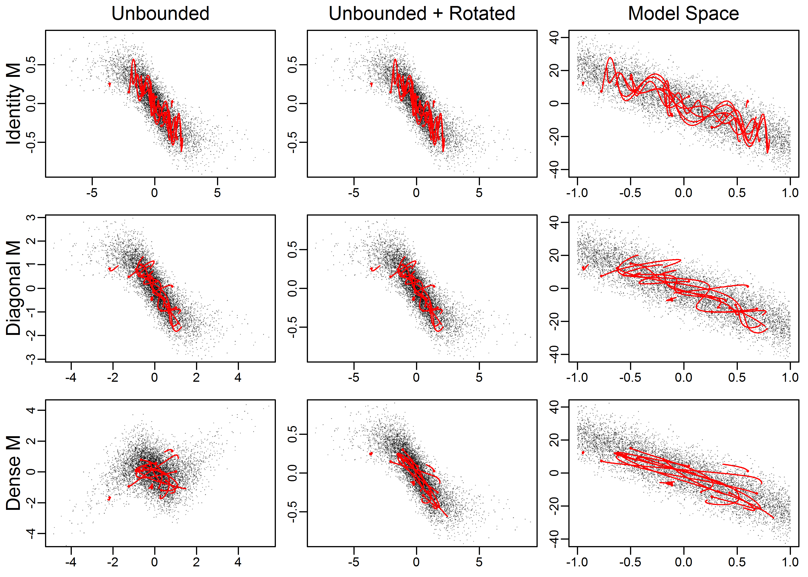

```{r, include = FALSE}
knitr::opts_chunk$set(
  collapse = TRUE,
  comment = "#>"
)
```

```{r setup}
library(adnuts)
```

Key features of the packages:

-   Run no-U-turn sampler (NUTS) or random walk Metropolis (RWM) MCMC
    chains from within R using the `sample_nuts` and 'sample_rwm'
    functions.
-   Parallel execution with automatic merging of chains and linking to
    other R packages provides a smooth, efficient workflow for ADMB
    users.
-   Adaptation of the NUTS stepsize is automatically done during the
    warmup phase.
-   The mass matrix options are: diagonal or dense adaptation during
    warmup, the estimated covariance (from admodel.cov file), or an
    arbitrary dense matrix can be passed from R.
-   Easy diagnostic checking using functionality provided by packages
    `rstan` and `shinystan`.
-   A 'duration' argument to stop the chains running after a specified
    period of time (e.g., 2 hours), returning whatever samples were
    generated in that period.
-   When running multiple chains, whether in parallel or serial, samples
    are merged and written to the '.psv' file. Thus, executing the model
    in the '-mceval' phase uses all chains, including with an 'mceval'
    argument dictating whether to run in this phase when the sampling is
    finished.
-   A modified pairs plot designed to help facilitate comparison between
    MLE estimates and covariances, and the posterior samples.

Typically, for well-designed models, NUTS works efficiently with default
settings and no user intervention. However, in some cases you may need
to modify the settings. See below for a brief description of NUTS and
how you can modify its behavior and when needed. Guidance and
performance specifically designed for fisheries stock assessment is
given in [@monnahan2019].

## Sampling for ADMB models

### Setting up the model

In general very little is needed to prepare an ADMB model for use with
`adnuts`. As with any model, the user must build the template file to
return a negative log likelihood value for given data and parameters.
The user is responsible for ensuring a valid and reasonable model is
specified. Typical model building practices such as building complexity
slowly and validating with simulated data are strongly encouraged. Users
must manually specify priors, otherwise there are implicit improper
uniform distributions for unbounded parameters, and proper uniform
distributions for bounded parameters (see below for more details).

The ADMB model is an executable file that contains the code necessary
for NUTS and RWM. When run, it typically has various input files and
generates many output files. As such, **I strongly recommend putting the
model into a subdirectory below the directory containing the R script**
(passed as the `path` argument). **This is required for parallel
execution** but is recommended in general.

### Sampling with sample_nuts and sample_rwm

Sampling for ADMB models is accomplished with the R functions
`sample_nuts` and `sample_rwm` which replace the deprecated function
`sample_admb`. These functions are designed to be similar to Stan's
`stan` function in naming conventions and behavior. Some differences are
necessary, such as passing a model name and path. The two MCMC
algorithms, NUTS and RWM, are built into the ADMB source code so this is
just a wrapper function. Also note that this function does not do
optimization nor Variational Inference.

The default behavior for NUTS is to run 3 chains with 2000 iterations,
with a warmup (i.e., burn-in) phase during the first 1000. There is no
external thinning (in a sense it is done automatically within the
algorithm), and thus the `-mcsave` option does not work with NUTS by
design. These defaults work well in the case where diagonal mass matrix
adaptation is done (e.g., hierarchical models). This adaptation often
requires a long warmup period. For models starting with a good mass
matrix (e.g., from the MLE covariance or previous run), a much shorter
warmup period can be used. For instance `warmup=200` and `iter=800` with
multiple chains may work sufficiently well during model development.
Users of the RWM algorithm will accustomed to running millions of
iterations with a high thinning rate. **Do not do that!**. The key thing
to understand is that NUTS runs as long as it needs to get nearly
independent samples. Consult the Stan documentation for advice on a
workflow for NUTS models (e.g., [this
guide](https://mc-stan.org/users/documentation/case-studies/rstan_workflow.html))

For poorly-constructed or over-parameterized models, the NUTS algorithm
will be potentially catastrophically slow. This is likely common in many
existing fisheries stock assessment models. In these cases it can be
very informative to run the RWM algorithm with `sample_rwm` because it
often provides fast feedback from which the user can determine the cause
of poor mixing (see [@monnahan2019]). Consult the ADMB documentation for
more information on a workflow with these samplers. `adnuts` provides no
new options for RWM compared to the command line from previous ADMB
versions (besides a better console output), but the option for parallel
execution and integration with MCMC diagnostic tools provided by adnuts
should be sufficiently appealing to users. Once a model is more
appropriately parameterized, NUTS should be used. Further work on
optimal parameterizations for fisheries model is needed. This vignette
only covers the functionality of the package.

One important overlap with Stan is with the `control` argument, which
allows the user to control the NUTS algorithm:

-   Metric or mass matrix (adapted diagonal or dense matrix) [`metric`]

-   Maximum treedepth for trajectories [`max_treedepth`']

-   Target acceptance rate [`adapt_delta`]

-   Step size, which if NULL (recommended) is adapted [`stepsize`]

-   Mass matrix adaptation tuning parameters (not recommended to change)
    [`adapt_init_buffer`, `adapt_term_buffer`, `adapt_window`]

This function returns a list (of class `adfit`) whose elements mimic
some of that returned by `stan` to be useful for plugging into some
`rstan` tools (see below).

### mceval phase and posterior outputs

No special output files are required to run the model with `adnuts`. In
addition, the user can still use the `mceval_phase` flag to run specific
code on saved samples. ADMB saves posterior draws to a .psv file. When
executing the model with `-mceval` it will loop through those samples
and execute the procedure section with flag `mceval_phase()` evaluating
to 1. This behavior is unchanged with `adnuts`, but is complicated when
running multiple chains because there will be multiple .psv files. Thus,
`sample_nuts` combines chains in R and writes a single .psv file
containing samples from all chains (after warmup and thinned samples are
discarded). This also works in parallel (see below). Consequently, the
user only has to set `mceval=TRUE`, or run `-mceval` from the command
line after `adnuts` finishes sampling, in order to generate the desired
output files.

Previously, ADMB required an estimated covariance function to use the
random walk Metropolis (RWM) algorithm. Thus, for models without a valid
mode or a Hessian that could not be inverted could not use MCMC methods.
With `adnuts` neither an MLE nor covariance estimate is needed because
NUTS adapts these tuning parameters automatically (see below). However,
if a mode exists I recommend estimating the model normally before
running MCMC.

`sample_nuts` or `sample_rwm` are strongly recommended for running the
MCMC. However, it is a convenience function that runs the chains from
the command line. The list returned contains an element `cmd` which
shows the user the exact command used to call the ADMB model from the
command line. The command line can also be useful for quick tests.

### Bounds & Priors

Parameter priors must be specified manually in the ADMB template file.
For instance, a standard normal prior on parameter `B` would be
subtracted from the objective as `f+=dnorm(B,0.0,1.0)`. Note that
contributed statistical functions in ADMB, such as `dnorm`, return the
negative log density and thus must be added to the objective function.

Parameter transformations are limited to box constraints within the ADMB
template (e.g., `init_bounded_number`). When used, this puts an implicit
uniform prior on the parameter over the bounds. Implicit improper
uniform priors occur when an unbounded parameter has no explicit prior.
The analysis can proceed if the data contain information to update the
prior, but if not the chains will wander between negative and positive
infinity and fail diagnostic checks.

Variance parameters are common and require bounds of (0, Inf). To
implement such a bound in ADMB, specify the model parameter as the log
of the standard deviation, and then in the template exponentiate it and
use throughout. Because of this parameter transformation, the Jacobian
adjustment is needed. This can be accomplished by subtracting the
parameter in log space from the negative log-likelihood. For instance,
use parameter `log_sd` in the template, then let `sigma=exp(log_sd)`,
and update the objective function with the Jacobian: `f-=log_sd;`. The
recommended half-normal prior for standard deviations can then be added
as, e.g., `f+=dnorm(sigma,0,2)`. This also holds for any positively
constrained parameters of which there are many in ecology and fisheries:
somatic growth rates, maximum length, unfished recruits, etc.

### Initializing chains

It is generally recommended to initialize multiple chains from
"dispersed" values relative to the typical set of the posterior. The
sampling functions can accept a list of lists (one for each chain), or
function which returns a list of parameters (e.g.,
`init <- function() list(a=rnorm(1), eta=rnorm(10))`. If no initial
values are specified `init=NULL` then ADMB will attempt to read in the
optimized values stored in the admodel.hes file. Typically these are the
MLE (really MPD) values. Starting all chains from the model is
discouraged because it makes diagnostic tools like Rhat (see below)
inefficient. From [this
discussion](https://discourse.mc-stan.org/t/overdispersed-initial-values-general-questions/3966)
"...Rhat is ratio of overestimate and underestimate of variance, but
that overestimate is overestimate only if the starting points are
diffuse." Consequently I **strongly encourage creating a function to
generate reasonable random initial values**.

If your model has inactive parameters (those with negative phases) they
are completely ignored in the MCMC analysis (sampling, inputs, outputs,
etc.), so the initial values are only for active parameters. This means
you cannot read in the .par file and use it for initial values if there
are inactive parameters.

### Parallel sampling

Parallel sampling is done by default as of version 1.1.0. It is done by
parallelizing multiple chains, not calculations within a chain. The
`snowfall` package is used. `n.cores` chains will be run by making
temporary copies of the directory `path` (which contain the model
executable, data inputs, and any other required files). Then a separate
R session does the sampling and when done the results are merged
together and the temporary folders deleted. If errors occur, these
temporary folders may need to be deleted manually. The default behavior
is to set `n.cores` to be one fewer than available to the system, but
the user can override this and by setting `n.cores=1` the chains will be
run in serial which can be useful for debugging purposes.

## Diagnostics and plotting results

### Diagnosing MCMC chains

MCMC diagnostics refers to checking for signs of non-convergence of the
Markov chains before using them for inference, and is a key step in
Bayesian inference. There is a large literature related to this which I
refer unfamiliar readers to the Stan manual [chapter on
convergence](https://mc-stan.org/docs/2_23/reference-manual/convergence.html).
Note that the user is entirely responsible for this component of the
analysis, `adnuts` only provides tools to help with it.

The `rstan` package provides an improved function for calculating
effective sample size and $\hat{R}$ statistics vis the function
`rstan::monitor`. This function is automatically run for completed runs
and stored in the output. For very large models (either many parameters
or many iterations) this operation can be slow and thus a user may
disable it with the argument `skip_monitor`, however this situation
should be rare as these quantities should always be checked.

I use a hierarchical mark-recapture model of swallows to demonstrate
functionality, taken from the examples in [@monnahan2017] read in as a
RDS file from a previous run.

```{r, eval=TRUE, echo=FALSE}
library(adnuts)
```

The diagnostic information can be directly accessed via the fitted
object `fit`. :

```{r}
fit <- readRDS('fit.RDS')
print(fit)
summary(fit$monitor$n_eff)
summary(fit$monitor$Rhat)
```

The Rhat values are sufficiently close to 1 but the minimum effective
sample size is 71 which is too few for inference so longer chains should
be run. Both the model parameters and the NUTS sampler parameters can be
extracted as a data frame.

```{r}
post <- extract_samples(fit)
str(post[,1:5])
sp <- extract_sampler_params(fit)
str(sp)
```

These functions have options whether to include the warmup and
log-posterior (lp) column, but also whether to return the unbounded
parameters. The latter can be useful for debugging issues with
parameters with high density near the bounds or poor mixing issues when
using RWM chains.

The object returned by `sample_nuts` and
`sample_rwm' can also be plugged directly into the ShinyStan interactive tool environment by calling the wrapper function`launch_shinyadmb(fit)`after loading the`shinystan`library. See ShinyStan documentation for more information on this. It is designed to provide NUTS specific diagnostics, but also serves as a more general tool for MCMC diagnostics and thus is beneficial for RWM chains as well. If desired, the output samples can be converted into`mcmc\`
objects for use with the CODA R package. For instance, CODA traceplots
can be accessed like this:

```{r, eval=FALSE, echo=TRUE}
post <- extract_samples(fit, as.list=TRUE)
postlist <- coda::mcmc.list(lapply(post, coda::mcmc))
coda::traceplot(postlist)
```

Or into `bayesplot` with a little massaging. Future versions of adnuts
may link these more directly. But for now it can be done manually such
as with the energy diagnostic:

```{r, eval=FALSE, echo=TRUE}
library(bayesplot)
library(dplyr)
library(tidyr)
library(ggplot2)
color_scheme_set("red")
np <- extract_sampler_params(fit) %>%
  pivot_longer(-c(chain, iteration), names_to='Parameter', values_to='Value') %>%
  select(Iteration=iteration, Parameter, Value, Chain=chain) %>%
  mutate(Parameter=factor(Parameter),
         Iteration=as.integer(Iteration),
         Chain=as.integer(Chain)) %>% as.data.frame()
mcmc_nuts_energy(np) + ggtitle("NUTS Energy Diagnostic") + theme_minimal()
```

## Plotting output

A convenience function `plot_marginals` is provided to quickly plot
marginal posterior distributions with options to overlay the asymptotic
estimates.

```{r fig1, fig.width=6, fig.height=4.5}
plot_marginals(fit, pars=1:9)
```

Many ADMB models have well defined modes and estimated covariance
matrices used to quantify uncertainty. The `pairs_admb` function can be
used to plot pairwise posterior draws vs the MLE estimate and confidence
ellipses. Major discrepancies between the two are cause for concern. As
such, this can be a good diagnostic tool for both frequentist and
Bayesian inference. In particular, it often is informative to plot the
slowest mixing parameters or key ones by name as follows.

```{r fig2, fig.width=6, fig.height=4.5}
pairs_admb(fit, pars=1:3, order='slow')
pairs_admb(fit, pars=c('sigmaphi', 'sigmap', 'sigmayearphi'))
```

The last plot shows the three hypervariances of this hierarchical model.
The diagonal shows traces of two chains (colors), where alternative
options for argument `diag` are 'trace' (default), 'hist' for histogram,
and 'acf' for the autocorrelation function. The remaining plots show
pairwise posterior samples (black points) for the remaining parameters.
Divergences are shown as green points if they exist (none do here). A
red point shows the posterior mode and an ellipse shows the 95%
bivariate confidence region, taken from the inverse Hessian calculated
by ADMB. Since the log-posterior (lp\_\_) is not a parameter there is no
ellipse. Note that the posterior samples and asymptotic approximations
for the two fixed effects `a` match closely, whereas for the `sigmaphi`
hypervariance parameter there is a notable mismatch. This mismatch is
not surprising as estimates from optimizing hierarchical models are not
reliable. Since adaptive NUTS was used for sampling, the information
contained in red was not used and is only shown for illustration. The
option `metric='mle'` would use the inverse Hessian as a tuning
parameter (see section on metric below). More options for plotting fits
like these are available in the help file `?pairs_admb`.

## Mass matrix adaptation

I assume the reader is familiar with the basics of the mass matrix and
its effect on sampling with NUTS (if not, see section below). Note that
the mass matrix represents the geometry of the posterior in
untransformed (unbounded) space, not the parameter space defined by the
user. This space is typically hidden from the user but nonetheless is
important to recognize when thinking about the mass matrix.

ADMB has the capability to do both diagonal and dense (full matrix, as
of version 12.2) estimation during warmup (adaptation). The initial
matrix can likewise easily be initialized in two ways. First is a unit
diagonal, and second is the "MLE" option, which more accurately is the
covariance matrix calculated from inverting the Hessian at the maximum
posterior density (the mode -- informally referred to as the MLE often).
I refer to this as $\Sigma$. As such there are 6 options for the mass
matrix, summarized in the subsequent table. Note that options 3 and 6
were not available before `adnuts` version 1.1.0 and are only available
for ADMB \>= 12.2. Also not the differences in default behavior when
running from `sample_nuts` vs. the command line.

Note that dense estimation should be considered an experimental feature.
This option is in Stan but is rarely used. Stan users almost always use
option 2 below (the default in `adnuts`). As more models are fit this
advice will evolve. For now this is my best guess:

| Initial<br>matrix | Adaptation | adnuts | Command<br>line | Recommended usage |
|---------------|---------------|---------------|---------------|---------------|
| Unit | None | `adapt_mass=FALSE` | `-mcdiag` | Rarely if ever used |
| Unit | Diagonal | (default) | `-mcdiag`<br>`-adapt_mass` | Use with minimal correlations, $\Sigma$ is unavailable, or $d$\>1000. Often the best choice for hierarchical models |
| Unit | Dense | `adapt_mass_dense=TRUE` | `-mcdiag`<br>`-adapt_mass_dense` | Use when strong correlations but $\Sigma$ is unavailable and $d$\<500 |
| $\Sigma$ | None | `metric='mle'| (default) | When $\Sigma$ is good and $d$<1000 |  | $\Sigma$  | Diagonal |`metric='mle'`<br`adapt_mass=TRUE`|`-mcdiag`<br>`-adapt_mass`| When $\Sigma$ is OK and $d$>500.  | $\Sigma$  | Dense |`metric='mle'`<br>`adapt_mass_dense=TRUE`|`-adapt_mass_dense\` | When $\Sigma$ is OK but $d$\<500 |  |

$d$ refers to the dimensionality (\# of parameters) and this guidance is
a very rough guess. The reason dimensionality matters is that there is a
numerical cost to using a dense matrix over a diagonal one, and one that
scales poorly with dimensionality. However, the more computationally
expensive the model is (the prediction and log density calculations) the
smaller relative cost of the dense calculations. Thus there is an
interplay between the mass matrix form, dimensionality, model
computational cost, and MCMC sampling efficiency.

In addition to these options, an arbitrary matrix `M` can be passed via
`metric=M`. This works by using R to overwrite the admodel.cov file so
that when ADMB runs it reads it in thinking it was the estimated matrix.
The file admodel_original.cov is copied in case the user wants to revert
it. Probably the only realistic usage of this feature is when you have
already run a pilot chain and want to rerun it for longer, and wish to
use the samples to generate an estimated mass matrix. In this case use
`M=fit$covar.est` which is the estimate in unbounded space (see below).
Note that if `M=diag(d)` it is equivalent to the first three rows and if
`M`=$\Sigma$ it is equivalent to the last three rows.

The following figure shows the step size of a single chain during warmup
for these six options for a simple linear model, and demonstrates the
general differences among them.

{width="90%"}

The three which start with a unit diagonal matrix are apparent by their
small initial step sizes, while the three which start with dense are
larger. There is a clear shift in the stepsize at iteration 125 which is
when the first mass matrix update happens (and with improved knowledge
of the geometry the optimal step size changes). A second update happens
later but is not apparent, indicating the first was sufficient. All fits
with a dense matrix end with the same approximate step size, which is
larger than any without it. Option 3 starts off diagonal but after
updating to a dense matrix performs equivalently. For the diagonal
options, option 1 does not update, while option two starts at unit
diagonal and aftering updating the diagonal performs equally well as
option 5 which starts well.

This is the behavior on a trivial model, but it is often hard to
estimate a good dense mass matrix, especially in the first few phases of
warmup with very few samples. In such cases the Cholesky decomposition
of the estimated matrix may fail. Instead of crashing the run I coded
ADMB to instead do a diagonal estimate in this case, and try a dense
update at the next phase, repeating until warmup is over. Warnings are
printed to the console when this happens.

Which option to use in which situation is still an open question.
Certainly for hierarchical models where $\Sigma$ is not helpful or
doesn't exist, option 2 is likely the best. For fisheries stock
assessment models which already rely on $\Sigma$ options 4-6 are worth
exploring.


## The no-U-turn sampler implementation

### Brief review of Hamiltonian Monte Carlo

Hamiltonian Monte Carlo is a powerful family of MCMC algorithms that use
gradients to propose efficient transitions. We review the basics here
but refer to interested readers to [@neal2011; @betancourt2017intro;
@monnahan2017]. Instead of randomly generating a proposed point, to be
rejected/accepted, HMC generates *trajectories* from which a point is
chosen to be rejected/accepted. These trajectories use gradient
information and an analogy of a ball rolling on a surface is often used.
These trajectories are efficient when they can transition to nearly
anywhere on the posterior (stark contrast with random walk algorithms).
However, to do this they need to be well-tuned. Generally there are
three aspects of the algorithms that need to be tuned.

1.  The step size. How big of steps between points on a single
    trajectory. Bigger steps means fewer calculations (and thus faster),
    but has a negative cost of rejecting more points.
2.  The trajectory length. How long should a trajectory should be
    depends on many factors, and is not constant over the posterior. If
    it is too short, HMC resembles inefficient random walk behavior. If
    it is too long, computations are wasted.
3.  The "mass matrix" used. This matrix tells the algorithm about the
    global shape of the posterior so that it can generate better
    trajectories. When large discrepancies between marginal variances
    exist, the trajectories will be less efficient (e.g., one parameter
    has a marginal variance of 1, and another a marginal variance of
    1000).

The no-U-turn sampler is a powerful sampler because it automated the
tuning of the first two of these aspects [@hoffman2014]. During warmup
it tunes the step size to a target acceptance rate (default of 0.8)
which has been shown to be optimal [@betancourt2014]. Most importantly,
though, is that it uses a recursive tree building algorithm to continue
doubling the trajectory until a "U-turn" occurs, meaning going any
further would be wasteful computationally. Thus, trajectory lengths are
automatically optimal.

The original algorithm was implemented into the Bayesian statistical
software Stan [@carpenter2017; @stan2017]. In addition to the automation
of NUTS, Stan provides a scheme for adapting the step size during the
warmup phase. Estimated diagonal mass matrices correct for global
differences in scale, but not correlations. A dense matrix can also be
adapted, and corrects for global correlations, but comes at a higher
computation cost. Typically a diagonal matrix is best and thus is
default in both Stan and `adnuts`.

These three extensions lead to efficient HMC sampling with little to no
user intervention for a wide class of statistical models, including
hierarchical ones [@monnahan2017]. Since publication, further
developments have been made in HMC theoretical and practical research.
For instance, Stan now includes an update called "exhaustive" HMC
[@betancourt2016] that more efficiently samples from the points in a
trajectory.

### Algorithm implementation details

For ADMB `adnuts` uses the original algorithm
presented in [@hoffman2014]. However it also uses a similar mass matrix
adaptation scheme as used in Stan.

The algorithm is initiated with a unit diagonal mass matrix. During the
first 50 iterations only the step size is adapted. After the next 75
iterations an estimated variance for each parameter (in untransformed
space) is calculated and used as the new mass matrix. The next update
occurs after twice the iterations as the previous update. This process
repeats until the last 25 samples of the warmup phase. During this phase
the mass matrix is held constant and only the step size adapt. See the
Stan manual [@stan2017] for more details. The step size is adapted
during all warmup iterations. No information is returned about mass
matrix adaptation currently.

Once the warmup phase is over, no adaptation is done. Because of the
adaptation the warmup samples are not valid samples from the posterior
and *must* be discarded and not used for inference.

### User intervention

In some cases you will need to adjust the behavior of the NUTS algorithm
to improve sampling. Here I review the three options for intervention
(step size, trajectory lengths, mass matrix) that a user can take, and
when and why they might need to.

A maximum tree depth argument is used to prevent excessively long
trajectories (which can occur with poorly specified models). This is set
to 12 (i.e., a length of $2^12=4096$ steps) by default, which typically
is long enough that a U-turn would occur. However, in some cases a model
may need to make longer trajectories to maintain efficient sampling. In
this case you will get warnings about exceeding maximum tree depth.
Rerun the model with `control=list(max_treedepth=14)` or higher, as
needed.

Recall that a single NUTS trajectory consists of a set of posterior
samples, resulting from a numerical approximation to a path along the
posterior. The step size controls how close the approximation is along
the true path. When the step size is too large and encounters extreme
curvature in the posterior a divergence will occur. Divergences should
not be ignored because they could lead to bias in inference. Instead,
you force the model to take smaller step sizes by increasing the target
acceptance rate. Thus, when you get warnings about divergences, rerun
the model with `control=list(adapt_delta=.9)` or higher, as necessary.
If the divergences do not go away, investigate the cause and try to
eliminate the extreme curvature from the model, for example with a
reparameterization [@stan2017; @monnahan2017].

If there are extreme global correlations in your model, NUTS will be
inefficient when using a diagonal mass matrix (the default). In this
case, you can pass a dense matrix, estimated externally or from previous
runs (previous fits contain an element `covar.est` which can be passed
to the next call). Do this with `control=list(metric=M)` where M is a
matrix in untransformed space that approximates the posterior. For ADMB
models, you can try using the MLE covariance by setting
`control=list(metric="mle"). Note that, for technical reasons, you need to reoptimize the model with the command line argument`-hbf\`.
(ADMB uses different transformation functions for HMC so the covariance
would be mismatched otherwise). Note that when using a dense mass matrix
there is additional computational overhead, particularly in higher
dimensions. That is, a dense matrix leads to shorter trajectories, but
they take longer to calculate. Whether a dense metric is worth the
increase in sampling efficiency will depend on the model.

The following figure demonstrates the effect of the mass matrix on a 2d
normal model with box constraints. The columns denote the different
model "spaces" and the rows different mass matrices. Random, arbitrary
NUTS trajectories are show in red over the top of posterior draws
(points). The right column is the model space, the middle the
untransformed, and the far left the untransformed after being rotated by
the mass matrix. Note the differences in scales in the axes among plots.
The key here is the rightmost column. The top panel is with no mass
matrix (i.e., unit diagonal), and the trajectories ungulate back and
forth as they move across the posterior. Thus to go from one end to the
other is not very straight. When a diagonal matrix is used, the
trajectories become noticeably straighter. Finally, with the dense
matrix the trajectories are even better. This is the effect of the mass
matrix: trajectories can move between regions in the posterior more
easily.



## Algorithm validity

Software bugs in the MCMC algorithms can manifest as biased sampling
from the target distribution. This is a serious issue and one that can
be hard to detect. One way to check this is to run the algorithms on
known distributions and check estimated properties against the
analytical. I checked this with normal, t with df=4 and df=10, gamma,
inverse gamma, truncated normal, and multivariate normal. I ran long
chains (1 million samples) with thinning rate of 10 for NUTS, and
compared this to an equivalent set of points from RWM and IID samples
from Monte Carlo samples (e.g., `rnorm`). Long chains and thining
ensured no residual autocorrelation. I repeated this for 20 chains for
the RWM, NUTS with MLE metric, adaptive NUTS, and Monte Carlo (mc).
Results are plotted as relative error of different probabilities (via
`pnorm` etc.).

{width="100%"}

All cases are mean 0, and MC is indistinguishable from MCMC. This
provides strong evidence that the algorithms are coded correctly. This
**does not** mean that finite samples from target distributions are
unbiased.

## References
